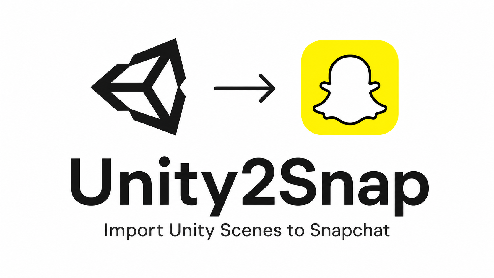
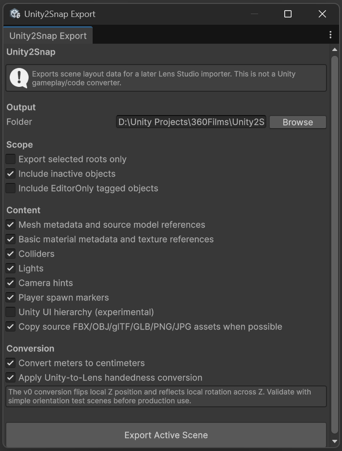
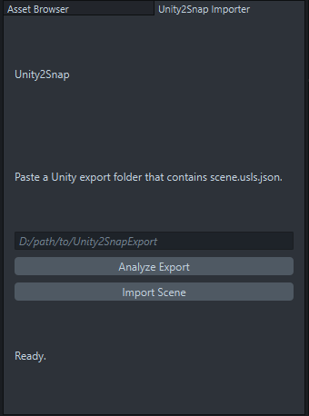

# Unity2Snap - Import Unity Scenes to Snapchat



[](https://github.com/Pratik77221/Unity2Snap)
[](UnityPackage/package.json)
[](LensStudioPlugin)

Unity2Snap is a bridge for moving Unity scene layout data into Snapchat Lens Studio, with Spectacles projects as the main target.

The core idea is simple: Unity exports a scene manifest, Lens Studio imports that manifest and rebuilds the scene hierarchy. It does not try to convert Unity gameplay code into Lens Studio scripts.

```text
Unity scene -> scene.usls.json + assets -> Lens Studio scene objects
```

## Demo [ Sound ON ]

<video src="media/demo.mp4" controls width="100%"></video>

## What Works

- Unity hierarchy export with stable IDs, names, enabled state, and parent relationships
- Local transforms converted from Unity meters to Lens Studio centimeters
- Selected-root parent transform anchors for XR/VR rig alignment
- Unity primitive detection: box, plane, sphere, cylinder, capsule
- Lens Studio primitive fallback mesh generation
- Unity material base color export
- Texture copy or PNG bake fallback for material textures
- Generated Lens materials assigned to imported mesh/model visuals
- Per-material OBJ/MTL fallback generation for Unity primitives
- Lights mapped to Lens `LightSource` components
- Camera hints for Spectacles/device-camera workflows
- Player/XR rig markers used to offset imported scene root
- Basic collider metadata and guarded Lens physics collider creation
- Unity-side pre-export analysis for counts, warnings, and import risks
- Human-readable export report and import warning summary

## Current Limits

- Unity scripts, MonoBehaviours, interactions, and gameplay systems are not converted
- Custom shaders are reduced to base color and simple texture references
- Complex materials, VFX, post-processing, animation controllers, and Unity UI need manual rebuilds
- Arbitrary embedded meshes still need a future per-object GLB/FBX extraction pipeline
- Physics import is first-pass only and should be validated inside Lens Studio

## Repository Layout

```text
Unity2Snap/
  UnityPackage/              Unity Package Manager package
    package.json
    Editor/
    Runtime/
  LensStudioPlugin/          Lens Studio plugin modules directory
    Unity2SnapImporter/
      module.json
      main.js
      importer-core.js
  docs/
    ROADMAP.md
    USLS_CONTRACT.md
  media/
    poster.png
    Unity_Package.png
    Snap_Package.png
  README.md
  CHANGELOG.md
```

## Unity Setup

Recommended:

- Unity 2021.3 LTS or newer
- Tested target workflow: Unity 6 and Lens Studio 5.x

Install from Git URL:

```text
https://github.com/Pratik77221/Unity2Snap.git?path=/UnityPackage
```

Or install from a local clone:

1. Open Unity Package Manager.
2. Click `+`.
3. Choose `Add package from disk...`.
4. Select `UnityPackage/package.json`.

If Unity reports an old dependency error for `com.unitysnapbridge.usls-exporter`, remove that entry from your Unity project's `Packages/manifest.json` and add:

```json
"com.pratik77221.unity2snap": "file:D:/A_Projects/Unity-Snap_Bridge/UnityPackage"
```

This repository also includes a root compatibility `package.json` so older local-path installs do not fail while you migrate.

Export a scene:



1. Open the Unity scene you want to export.
2. Go to `Tools > Unity2Snap > Export Active Scene`.
3. Use the top `Analyze` / `Export` menu to switch panels.
4. In `Analyze`, click `Analyze Scene` to preview object counts, warnings, and import risks.
5. In `Export`, choose an output folder, for example `Unity2SnapExport`.
6. Click `Export Active Scene`.

Unity writes:

```text
Unity2SnapExport/
  scene.usls.json
  report.md
  assets/
    meshes/
    textures/
```

## Lens Studio Setup



1. Open Lens Studio.
2. Open `Preferences > Plugins`.
3. Under `Additional Libraries`, add this folder:

   ```text
   LensStudioPlugin
   ```

4. Enable `Unity2Snap Importer`.
5. Open the importer panel.
6. Click `Browse Folder...` and choose the Unity export folder containing `scene.usls.json`.
7. Review the analysis summary, then click `Import Scene`.

Do not add `LensStudioPlugin/Unity2SnapImporter` directly. Lens Studio expects the parent plugin modules directory.

## Spectacles Notes

Unity2Snap treats VR/XR rig roots as authored user-origin references. On import, the Lens Studio scene root is offset so the selected Unity player/XR rig marker lands at Lens origin. This preserves authored room-scale layout while keeping Spectacles device tracking in charge of the camera.

For best results, export the parent rig root or full scene. If you export selected children, Unity2Snap automatically includes transform-only parent anchors so world placement survives.

## Format

The shared format is `scene.usls.json`. It contains:

- `objects`: hierarchy, transforms, types, metadata
- `assets`: importable files and metadata-only assets
- `warnings`: conversion gaps and manual follow-up notes
- `stats`: counts for objects, materials, textures, lights, colliders, and warnings

See [docs/USLS_CONTRACT.md](docs/USLS_CONTRACT.md) for importer behavior and schema expectations.

## Roadmap

See [docs/ROADMAP.md](docs/ROADMAP.md) for the planned version rollout. The near-term focus is reliable visual fidelity, native Lens Studio primitive creation, safer reimport workflow, and richer scene metadata before Spectacles/XR setup.

## Repository

GitHub: https://github.com/Pratik77221/Unity2Snap
